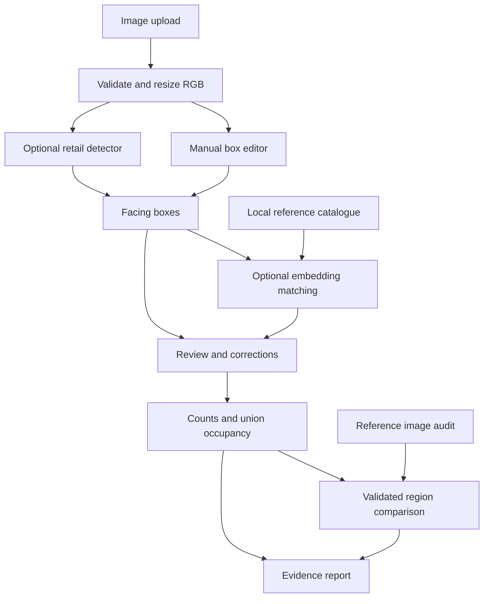

# ShelfSense — Kirana Shelf Auditor

A local Computer Vision project for students, kirana shop owners and retail auditors. Upload a shelf photograph, mark or detect visible product facings, compare them with a small product catalogue, and inspect possible display gaps.

**A facing is a visible product front, not total stock.** ShelfSense does not estimate products behind the front row, warehouse inventory, sales, counterfeit status or purchase quantities. Start with one shelf, 5–10 registered product types and a reasonably fixed camera position.

## Implementation choices

- **Working offline baseline:** numeric box annotation in Streamlit's editable table. Add, adjust and remove boxes, assign identities from your catalogue and export an audit. No PyTorch, GPU, API key or downloaded model is needed for this workflow.
- **Optional detector:** Ultralytics YOLO11-compatible axis-aligned detection `.pt` weights. Bring a trusted retail-trained checkpoint or train your own. The app never substitutes fake boxes when inference fails. COCO weights are useful for transfer learning, but are not a general retail package detector or SKU identifier.
- **Optional recognition:** torchvision ResNet18 `IMAGENET1K_V1`, with its final classifier replaced by an identity layer. Its pooled 512-dimensional features describe appearance; ImageNet categories are not used as product identities. Each crop is compared with multiple registered references using normalized cosine similarity. This is a lightweight baseline, not a fine-grained packaging expert.
- **Geometry:** explicit RGB/BGR conversions, EXIF orientation, resize mapping, exact union area, horizontal interval gaps, and ORB/RANSAC reference registration. No OCR, pixel subtraction inventory claims, paid services or image uploads to third parties.
- **Storage:** a single-user local JSON catalogue and PNG reference images. Atomic JSON replacement avoids partial writes. Multiple simultaneous catalogue writers are not supported.

## Features implemented

- JPEG/PNG content validation, EXIF correction, grayscale/alpha handling, 24-megapixel and 20-MB upload limits.
- Aspect-preserving resizing, blur warning, optional mild CLAHE for detection only. Recognition always sees original colour crops at analysis resolution.
- Editable, non-overlapping shelf rows and facing boxes; overlays, IDs, detector confidence and similarity shown separately.
- Product registration and metadata updates, multiple reference images, expected shelf region and optional minimum facing target. Updates append references; remove/re-register a product to replace its reference set.
- Unknown and ambiguous matches; ranked evidence and manual identity correction. Confidence and cosine similarity are not interchangeable.
- Counts by region/product, box-union visual occupancy, potential horizontal gaps, possible misplaced products and display-facing shortfalls.
- Reference alignment with quality gates; human confirmation; manual corresponding-region fallback or independent audits.
- Preserved initial results, committed corrections, coordinate metadata, catalogue snapshot, model names/thresholds, detector weight hash and timestamps in JSON/CSV exports.
- Original/annotated image views, PNG download, cache-aware model/reference loading, clear/reset, stale-setting protection and source-image invalidation.
- Detector training/evaluation scripts and download-free unit/integration tests.

## Architecture



Model inference is isolated from shelf business rules and UI state. Human edits commit as a batch; only committed edits affect reports. A new automatic run creates a fresh result and resets its correction log. Re-analysis in manual mode retains original evidence.

## Project structure

```text
shelfsense/
├── app.py
├── requirements.txt
├── requirements-models.txt
├── README.md
├── EVALUATION.md
├── .gitignore
├── .streamlit/config.toml
├── config/default_settings.json
├── src/
│   ├── __init__.py
│   ├── image_preprocessing.py
│   ├── product_detector.py
│   ├── product_matcher.py
│   ├── catalogue_manager.py
│   ├── shelf_analyzer.py
│   ├── image_alignment.py
│   ├── annotation_editor.py
│   ├── report_generator.py
│   ├── visualization.py
│   └── settings.py
├── scripts/
│   ├── train_detector.py
│   └── evaluate_detector.py
├── tests/
│   ├── test_image_preprocessing.py
│   ├── test_product_matching.py
│   ├── test_shelf_analysis.py
│   ├── test_catalogue_manager.py
│   ├── test_report_generator.py
│   ├── test_image_alignment.py
│   ├── test_settings.py
│   └── test_app.py
├── data/
│   ├── catalogue.json
│   ├── reference_images/.gitkeep
│   └── sample_images/
│       ├── README.md
│       ├── synthetic_shelf.png
│       ├── synthetic_boxes.json
│       ├── synthetic_annotated.png
│       └── synthetic_audit.json
├── models/README.md
└── outputs/.gitkeep
```

## Windows installation — manual mode first

Use **64-bit Python 3.11** from [python.org](https://www.python.org/downloads/windows/). The code also uses Python 3.12-compatible syntax. No compiler, CUDA or system OpenCV installation is required.

Save `ShelfSense.zip` in Downloads. Open PowerShell:

```powershell
New-Item -ItemType Directory -Force "$HOME\Projects" | Out-Null
Set-Location "$HOME\Projects"
Expand-Archive -LiteralPath "$HOME\Downloads\ShelfSense.zip" -DestinationPath .
Set-Location .\shelfsense
py -3.11 -m venv .venv
.\.venv\Scripts\Activate.ps1
python -m pip install --upgrade pip
python -m pip install -r requirements.txt
python -m streamlit run app.py
```

If script activation is blocked, activation is optional. Use the environment's executable directly:

```powershell
.\.venv\Scripts\python.exe -m pip install -r requirements.txt
.\.venv\Scripts\python.exe -m streamlit run app.py
```

Open `http://127.0.0.1:8501` if a tab does not open automatically. Stop the server with Ctrl+C. The server binds to localhost; use it on your own computer. Do not expose this single-user app to the public internet.

After packages are installed, manual mode runs offline. Keep **Enable reference-product matching** unchecked and **Analysis mode** set to `manual`.

### Five-minute manual walkthrough

1. Upload your photograph in **Shelf Audit**. For a deterministic example use `data/sample_images/synthetic_shelf.png`; it is explicitly synthetic, not a real-shop evaluation.
2. In **Define shelf rows / regions**, set a tight rectangle around a single shelf row. The displayed analysis width and height are authoritative. Coordinates start at the upper-left. `x2` and `y2` are the right and bottom edges, exclusive.
3. Click **Apply shelf regions**. Rows cannot overlap. A product's centre determines its one facing-count region; coverage uses all intersecting boxes clipped to each region. Boxes whose centres are outside all regions do not contribute to facing counts.
4. Add rows in the product-box table. Leave the ID cell blank; the application generates an ID. Supply all four coordinates. Blank product ID means unknown. Check **Remove** or select/delete a row to remove a box. Use the annotated preview to refine coordinates.
5. Click **Apply box / identity corrections**, then **Analyse Shelf**. This button uses already committed table edits. For automatic mode it re-runs the detector and replaces its earlier boxes.
6. Review visible facings, the occupancy bar, unknowns and potential gaps. Correct boxes/identities and apply again. All summaries and exports use these corrected results.
7. Download complete JSON, complete evidence CSV, region summary CSV, or the annotated PNG.

The editor is numeric/table-based rather than a drag-to-draw canvas. It is deliberately dependency-light and supports exact reproducible coordinates. The app holds audit state during reruns; closing/restarting the server loses unsaved audits. Download results before closing. The catalogue persists on disk.

### Register 5–10 products

In **Product Catalogue**, enter a stable product ID (letters, digits, `_`, `-`), readable name and one or more tightly cropped JPEG/PNG references. Add brand if useful. Product registration does not download models.

Use several front/near-front views, different lighting and realistic shelf-scale crops. Avoid embedding large background areas. Similar-looking sizes/flavours need separate IDs and careful validation. Different references of the same ID are grouped before the ambiguity test.

Set an expected shelf region using its exact name (for example `Shelf 1`). The minimum facing target applies to that region if supplied, otherwise to all audited regions. An absent expected region is marked **not audited**, rather than reporting a false shortage.

Catalogue edits invalidate existing audit state so identities and targets cannot silently use an old catalogue. Back up both `data/catalogue.json` and `data/reference_images/`. No images are included in JSON reports; references remain local.

## Optional models

Install the optional stack in the same environment. The first command installs the CPU builds explicitly:

```powershell
python -m pip install torch==2.6.0 torchvision==0.21.0 --index-url https://download.pytorch.org/whl/cpu
python -m pip install -r requirements-models.txt
```

PyTorch is a large download. A GPU is optional; CPU is the default. For CUDA, use the matching PyTorch/torchvision versions and appropriate CUDA wheels from [PyTorch's version instructions](https://pytorch.org/get-started/previous-versions/), then choose `cuda:0` in Settings. This package does not install or configure GPU drivers.

### Embeddings

Either select **Allow initial ResNet18 weight download** in Settings and enable matching, or preload its official weights once:

```powershell
python -c "from torchvision.models import resnet18, ResNet18_Weights; resnet18(weights=ResNet18_Weights.IMAGENET1K_V1)"
```

The checkpoint is approximately 44.7 MB, stored by PyTorch under its hub checkpoint cache (normally `%USERPROFILE%\.cache\torch\hub\checkpoints`). Keep this cache for subsequent offline use. The app refuses uncached weights unless initial download is enabled. Models and catalogue embeddings are also cached in process memory; reference content fingerprints invalidate embedding caches.

Default acceptance rules:

- Normalize the crop embedding and each reference embedding to unit length.
- Product score = maximum cosine similarity across that product's reference views.
- Best score below `0.85` → **Unknown product**.
- Best minus second-best product score below `0.05` → **Needs verification**, without assigning an identity.
- Otherwise accept a **Reference match**, still open to human correction.

These are starting thresholds, not calibrated accuracy guarantees. With one catalogue product there is no competing-product ambiguity check; the absolute threshold still applies. An unseen product can resemble a registered one and be falsely accepted. Cosine similarity is not probability. A manual correction clears matching evidence for the corrected identity/crop and retains the old evidence in the correction log. A changed box also clears detector confidence on that corrected box.

### Detector

No suitable universal kirana detector checkpoint is bundled. Put a trusted, retail-trained Ultralytics axis-aligned detection `.pt` checkpoint at `models/retail_best.pt`, or specify its absolute path in the sidebar:

```powershell
Copy-Item "C:\path\to\your\best.pt" .\models\retail_best.pt
python -m streamlit run app.py
```

Select automatic mode, set the checkpoint path and detection-confidence threshold, then analyse. The app accepts only existing local `.pt` files; it never downloads a detector implicitly. Class-agnostic NMS is used with configurable IoU, `imgsz=960` and `max_det=500`. Detector class labels remain separate evidence and are never promoted to catalogue identities. Detection coordinates are mapped by Ultralytics back to the analysis image; report mappings then translate them to the oriented original.

Only load checkpoints from sources you trust: a `.pt` file is executable model data. Segmentation, classification, oriented-box and arbitrary non-Ultralytics checkpoints are not supported by this adapter.

### Model availability and licensing

| Component | Availability | Licence / usage scope |
|---|---|---|
| Manual workflow | Included; no weights | Uses the listed open-source Python packages; no paid APIs |
| Ultralytics YOLO11 | Official starter weights are downloadable; retail fine-tuning required | Ultralytics offers AGPL-3.0 and commercial Enterprise licensing. Follow the applicable terms for distribution/deployment; this project does not grant a commercial exception |
| torchvision ResNet18 | Official ImageNet-1K weights via torchvision | torchvision code is BSD-3-Clause. Pretrained-weight use also requires attention to the training dataset's terms; do not assume the code licence is a blanket dataset/weight permission |
| Custom retail weights/data | User supplied | Check the exact checkpoint and dataset licences and retain provenance |

Primary references: [YOLO11](https://docs.ultralytics.com/models/yolo11/), [Ultralytics prediction API](https://docs.ultralytics.com/modes/predict/), [ResNet18 weights and transforms](https://docs.pytorch.org/vision/0.21/models/generated/torchvision.models.resnet18.html), [torchvision licence](https://github.com/pytorch/vision/blob/main/LICENSE), [pretrained model notice](https://docs.pytorch.org/vision/0.21/models.html).

The baseline uses ResNet18's official resize/centre-crop transform. This may discard packaging edges and is a limitation for small variants. Inference runs locally. Package/weight downloads require internet; uploaded images are not sent to any service. Streamlit usage telemetry is disabled in the project configuration.

### CPU expectations

No real-image timing benchmark is claimed. CPU detector inference and embedding each crop can be noticeably slow, especially with many boxes/references. Catalogue embeddings are cached; crop embeddings are recomputed during matching. Use one shelf and modest image sizes. Training on CPU is supported but can take a long time; a suitable GPU is preferable for training. RAM usage includes decoded full-resolution images, cached resized images and model tensors.

## Occupancy, gaps and comparisons

Estimated visual occupancy is `union area of clipped product boxes / shelf-region area`. Overlap is not double counted. Boxes include some background, so this is not pixel segmentation, shelf-depth usage or stock capacity.

Potential gaps are uncovered horizontal intervals between/around projected boxes, at least the configured fraction of region width. This assumes one narrow shelf row. A tall multi-row region is inappropriate. A missed, occluded or unknown package can exist in a reported gap. A zero-detection row reports a **potential** full-width gap, never confirmed emptiness.

`Display-facing shortfall = max(0, target - observed identified visible facings)`.

Unknown identities and missed boxes can inflate a shortfall. Treat it as an area for manual inspection, not an order quantity.

For reference comparison:

1. Complete the current shelf audit.
2. Upload a reference image. Attempt ORB/RANSAC alignment.
3. Review inlier count/ratio, feature coverage, median reprojection error, warped-area ratio and overlap. Current audit regions must also have almost complete valid warp coverage. No raw pixel difference is used to infer a missing product.
4. If alignment passes, visually confirm correspondence. Audit the warped reference in the same regions, using manual boxes or your detector. Warped reference coordinates refer to the current-image canvas, not directly to the original reference photo; the report includes the reference-to-current homography.
5. If alignment fails, choose **Manual corresponding regions**, define matching names on the native reference image and confirm that they cover the same physical shelf areas. Manual confirmation is the correspondence evidence. Area-based occupancy comparisons can still be affected by perspective.
6. Compare only after both audits are complete. Lower identified-facing counts are possible missing facings requiring verification. They are not evidence of sales or total inventory change. Alternatively download an independent reference audit without claiming comparison.

Geometric thresholds are conservative heuristics, not a guarantee of correct semantic alignment. Repeated packaging may create misleading feature matches. The explicit human check remains necessary.

## Train or fine-tune a retail detector

SKU-110K contains dense retail product bounding boxes and can support generic product detection; it does not assign the specific identities in your catalogue. See the [original project](https://github.com/eg4000/SKU110K_CVPR19) and [Ultralytics dataset documentation](https://docs.ultralytics.com/datasets/detect/sku-110k/). Obtain the dataset from its publisher, check its terms, and convert publisher annotations to YOLO format. It is not included or automatically downloaded here.

For a beginner-friendly local experiment, annotate your own shelf photographs with a single class, `product`. Include all visible fronts, unusual packaging, occlusions and true empty/negative scenes. Export YOLO detection labels from your annotation tool. Avoid uploading private shop imagery to third-party annotation services without permission.

Organize your dataset:

```text
data/datasets/kirana/
  images/train/   images/val/   images/test/
  labels/train/   labels/val/   labels/test/
```

Each image needs a same-stem `.txt` file. Each line is:

```text
0 center_x center_y width height
```

All four coordinates are normalized to image width/height. Example for a centred box covering half the width and height: `0 0.5 0.5 0.5 0.5`. A negative image has an empty label file. Use EXIF-oriented images when preparing labels. Split by capture session or shelf arrangement before annotation/export. Keep near-identical frames and reference crops from test captures out of training and calibration.

Create `config/kirana.yaml` with your real absolute path (forward slashes work on Windows):

```yaml
path: C:/Users/YOUR_NAME/Projects/shelfsense/data/datasets/kirana
train: images/train
val: images/val
test: images/test
names:
  0: product
```

Train from the official YOLO11 nano starter. This training command can download `yolo11n.pt` initially; unlike the audit app, the script explicitly supports this official starter name:

```powershell
python scripts/train_detector.py --data config/kirana.yaml --weights yolo11n.pt --epochs 50 --imgsz 960 --batch 4 --device cpu
```

Use `--device 0` for a configured CUDA GPU. For offline training, supply an existing local checkpoint instead of `yolo11n.pt`. Training writes to `outputs/training/shelfsense` (subsequent runs may increment the directory name). Copy the actual run's best weights:

```powershell
Copy-Item .\outputs\training\shelfsense\weights\best.pt .\models\retail_best.pt
```

## Tests and evaluation

Run from the project root, with only base dependencies installed:

```powershell
python -m pytest -q
```

Tests cover colour/grayscale/alpha/EXIF loading, corrupt images, resize mapping, coordinate validation, unique region assignment, box-union occupancy, gaps/no detections, product rejection/ambiguity, shortfalls, catalogue updates, export completeness, corrections, alignment rejection/acceptance and the Streamlit manual workflow. Tests use synthetic arrays/boxes; no model downloads are needed.

Measure held-out detector performance:

```powershell
python scripts/evaluate_detector.py --weights models/retail_best.pt --images data/datasets/kirana/images/test --labels data/datasets/kirana/labels/test --confidence 0.35 --iou 0.5 --device cpu --output outputs/detector_evaluation.json
```

The script measures class-agnostic precision/recall at the chosen confidence and matching IoU, whole-image visible-facing count MAE and mean inference wall time after a warm-up. It requires every ground-truth label file; a missing file is an error, not an empty scene. It does not claim mAP. For standard mAP, use Ultralytics validation separately:

```powershell
python -c "from ultralytics import YOLO; YOLO('models/retail_best.pt').val(data='config/kirana.yaml', split='test', imgsz=960, device='cpu', workers=0)"
```

See **EVALUATION.md** for known-product accuracy, unknown rejection, potential-gap precision/recall, timing and leakage controls. No real-world accuracy or model-inference timing has been measured for this supplied project.

## Example output

The included synthetic scene has three hand-specified facings in region `[20, 40, 780, 280]`, with boxes `[40, 70, 180, 270]`, `[200, 70, 340, 270]`, `[500, 70, 660, 270]`. With no catalogue, all three identities are unknown. The computed union coverage is `88000 / 182400 = 48.2456%`. At an 8% minimum width, two potential gaps are `[340,40,500,280]` and `[660,40,780,280]`.

This is a deterministic geometry example, not detector output or a real-image accuracy metric. Full computed JSON and annotated PNG are provided under `data/sample_images/`.

The complete evidence CSV uses `section,index,value_json` rows so nested corrections and comparison evidence are not dropped. The separate region summary CSV is easier to view in Excel. JSON is the recommended complete audit format.

## Limitations

- Occlusion and hidden rows prevent inventory counting; only visible annotated/detected fronts are counted.
- Reflective packaging, blur, small products and confusing variants can degrade both detection and matching.
- ImageNet embeddings can confuse similar-looking products and falsely accept unseen products. No calibrated confidence or production accuracy is claimed.
- Retail dataset domain differences require local validation/fine-tuning. Generic COCO models may miss most packages or detect irrelevant objects.
- Incorrect/duplicate detections bias facing counts; review boxes even though coverage uses unions. NMS may also remove tightly packed true facings.
- Camera movement, parallax and repetitive patterns can defeat alignment. Manual correspondence does not remove perspective distortion.
- Bounding-box gaps and occupancy are coarse display estimates, not physical empty-space measurements.
- The initial app is single-user/local and uses numeric rectangle editing. It has no database server, audit reload/import UI, background inference or multi-user locking.
- Models and real retail datasets are not bundled. The optional GPU/model paths require validation on your own machine and images.

## Future improvements (not implemented)

Drag-to-draw annotation canvas, perspective-normalized shelf planes, fine-tuned retail embeddings, calibrated rejection thresholds, audit import/history browser, faster batched crop embeddings, segmentation occupancy, multi-user SQLite-backed workflows and validated real-shop benchmarks.
